<picture align="center">
  <source media="(prefers-color-scheme: dark)" srcset="https://pandas.pydata.org/static/img/pandas_white.svg">
  
</picture>

-----------------

# Прохождение внешнего курса на Stepik ("Введение в Linux")

| | |
| --- | --- |
| Мой канал | [[Rutube](https://rutube.ru/plst/909045/)] |
| Мой канал | [[plvideo](https://plvideo.ru/playlist?list=SuymwXRNSHg3)] |
| Прохождение на github | [[GitHub](https://github.com/migolovina/study_2024-2025_os_intro/tree/master/stepik)]|
| Ссылка на сертификат | [[Stepik](https://stepik.org/cert/2791854)]|

## Что это?

Моё подробное прохождение курса "Введение в Linux"

## Цель

Познакомиться с операционной системой Linux и её базовыми возможностями. 

## Задания

1. Введение
2. Общая информация о курсе
3. Как установить Linux
4. Осваиваем Linux
5. Terminal: основы
6. Запуск исполняемых файлов
7. Ввод / вывод
8. Скачивание файлов из интернета
9. Работа с архивами
10. Поиск файлов и слов в файлах
11. Работа на сервере
12. Знакомство с сервером
13. Обмен файлами
14. Запуск приложений
15. Контроль запускаемых программ
16. Многопоточные приложения
17. Менеджер терминалов tmux
18. Как установить Linux: расширенное руководство
19. Продвинутые темы
20. Текстовый редактор vim
21. Скрипты на bash: основы
22. Скрипты на bash: ветвления и циклы
23. Скрипты на bash: разное
24. Продвинутый поиск и редактирование
25. Строим графики в gnuplot
26. Разное

## Этап 1

В первом этапе внешнего курса мне нужно было: рассмотреть общую информацию, рассмотреть способы установки Linux, освоить Linux, запустить Terminal, а также изучить несколько базовых команд для работы в нём, рассмотреть запуск исполняемых файлов, рассмотреть ввод/вывод, рассмотреть скачивание файлов из интернета, рассмотреть работу с архивами, рассмотреть способы поиска файлов и ответить на тестовые вопросы.

**После просмотра общей информации, мне нужно было ответить на следующие тестовые вопросы:**

# Задание 1.1.3

# Задание 1.1.5

**После просмотра способов установки Linux, мне нужно было ответить на следующие тестовые вопросы:**

# Задание 1.2.6

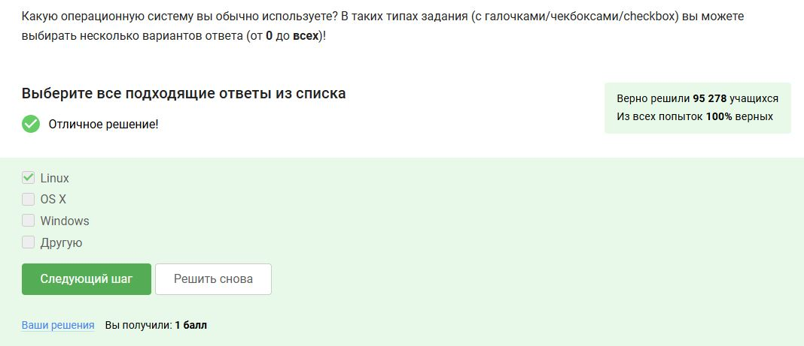

# Задание 1.2.8

# Задание 1.2.10

**После освоения Linux, мне нужно было ответить на следующие тестовые вопросы:**

# Задание 1.3.4

# Задание 1.3.6

# Задание 1.3.8

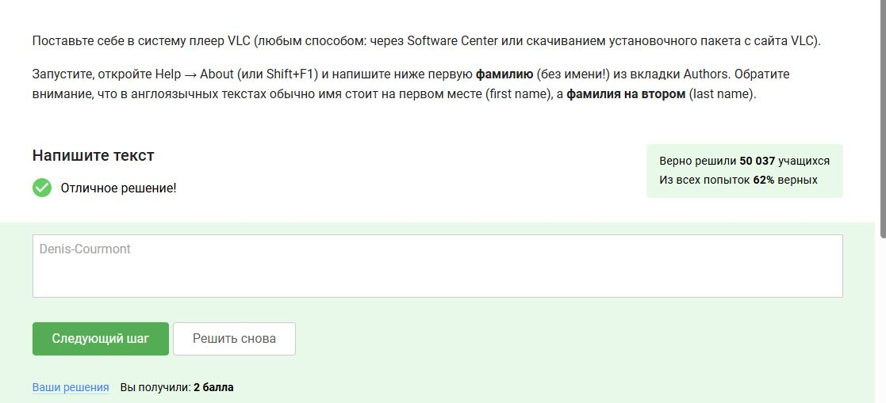

# Задание 1.3.10

**После запуска Terminal, а также изучения нескольких базовых команд для работы в нём, мне нужно было ответить на следующие тестовые вопросы:**

# Задание 1.4.3

# Задание 1.4.5

# Задание 1.4.7

# Задание 1.4.10

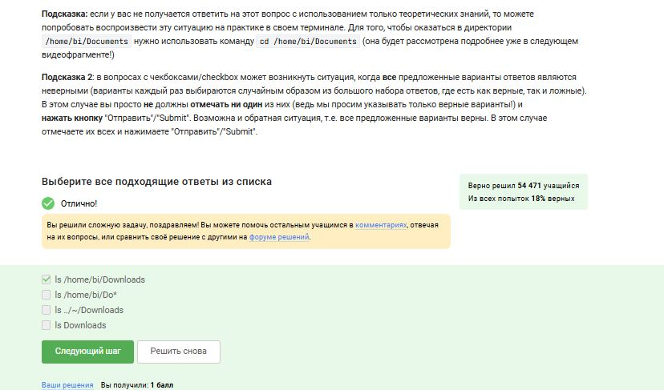

# Задание 1.4.12

**После просмотра запуска исполняемых файлов, мне нужно было ответить на следующие тестовые вопросы:**

# Задание 1.5.3

# Задание 1.5.6

# Задание 1.5.7

**После просмотра ввода/вывода, мне нужно было ответить на следующие тестовые вопросы:**

# Задание 1.6.4

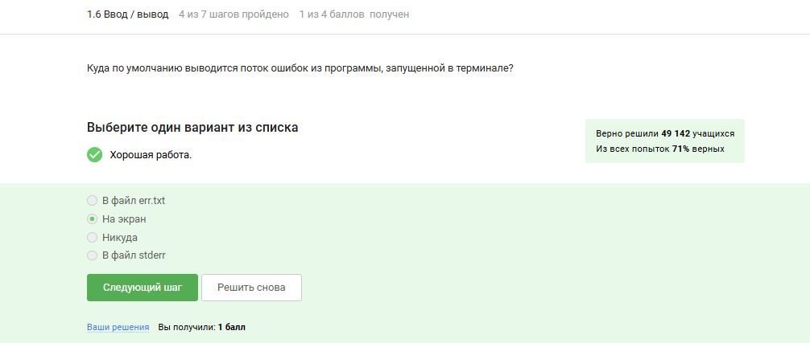

# Задание 1.6.5

# Задание 1.6.8

**После просмотра скачивания файлов из интернета, мне нужно было ответить на следующие тестовые вопросы:**

# Задание 1.7.3

# Задание 1.7.5

# Задание 1.7.7

**После просмотра работы с архивами, мне нужно было ответить на следующие тестовые вопросы:**

# Задание 1.8.3

# Задание 1.8.5

# Задание 1.8.7

**После просмотра способов поиска файлов и слов, мне нужно было ответить на следующие тестовые вопросы:**

# Задание 1.9.3

# Задание 1.9.5

# Задание 1.9.6

**Я закончила выполнение первого этапа внешнего курса, приступила к второму этапу.**

## Этап 2

Во втором этапе внешнего курса мне нужно было: познакомиться с сервером, рассмотреть обмен файлами, рассмотреть запуск приложений, рассмотреть контроль запускаемых приложений, познакомиться с многопоточными приложениями, познакомиться с Менеджером терминалов tmux и ответить на тестовые вопросы.

**После знакомства с сервером, мне нужно было ответить на следующие тестовые вопросы:**

# Задание 2.1.3

# Задание 2.1.6

**После просмотра обмена файлами, мне нужно было ответить на следующие тестовые вопросы:**

# Задание 2.2.4

# Задание 2.2.6

# Задание 2.2.8

**После просмотра запуска приложений, мне нужно было ответить на следующие тестовые вопросы:**

# Задание 2.3.4

# Задание 2.3.6

# Задание 2.3.7

# Задание 2.3.8

**После просмотра контроля запускаемых приложений, мне нужно было ответить на следующие тестовые вопросы:**

# Задание 2.4.5

# Задание 2.4.8

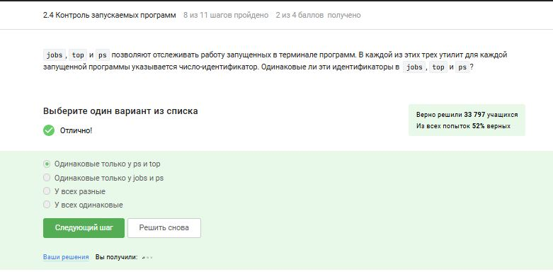

# Задание 2.4.10

# Задание 2.4.11

**После знакомства с многопоточными приложениями, мне нужно было ответить на следующие тестовые вопросы:**

# Задание 2.5.7

# Задание 2.5.8

# Задание 2.5.9

# Задание 2.5.12

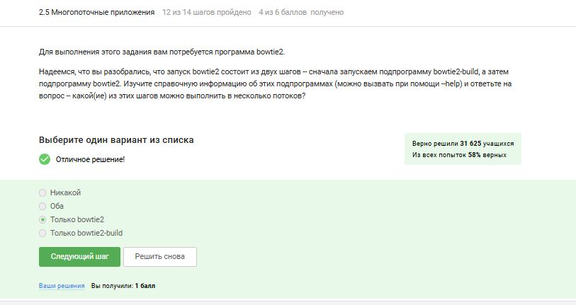

# Задание 2.5.13

**После знакомства с Менеджером терминалов tmux, мне нужно было ответить на следующие тестовые вопросы:**

# Задание 2.6.5

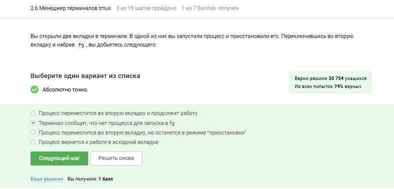

# Задание 2.6.10

# Задание 2.6.14

# Задание 2.6.15

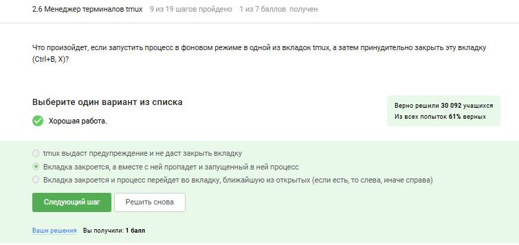

# Задание 2.6.18

# Задание 2.6.19

**Я закончила выполнение второго этапа внешнего курса, приступила к третьему этапу.**

## Этап 3

В третьем этапе внешнего курса мне нужно было: познакомиться с Текстовым редактор vim, познакомиться с основами скриптов на bash, изучить скрипты на bash: ветвления и циклы, изучить скрипты на bash: разное, изучить продвинутый поиск и редактирование, изучить построение графиков в gnuplot, изучить пункт Разное и ответить на тестовые вопросы.

**После знакомства с Текстовым редактор vim, мне нужно было ответить на следующие тестовые вопросы:**

# Задание 3.1.5

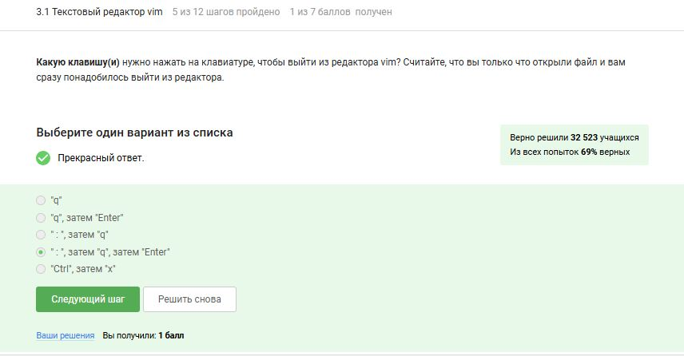

# Задание 3.1.7

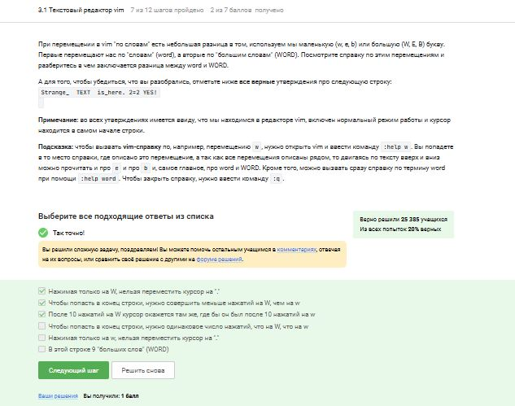

# Задание 3.1.8

# Задание 3.1.10

# Задание 3.1.11

**После знакомства с основами скриптов на bash, мне нужно было ответить на следующие тестовые вопросы:**

# Задание 3.2.3

# Задание 3.2.5

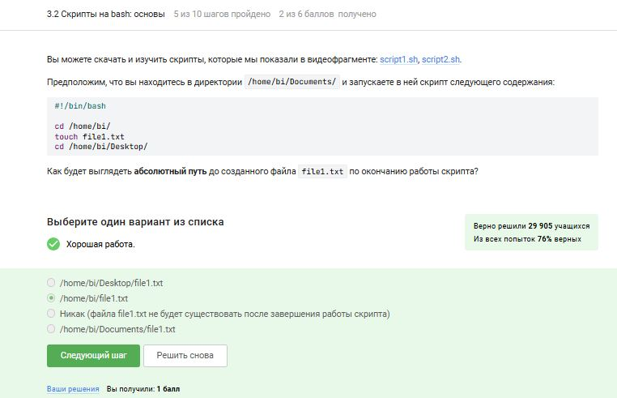

# Задание 3.2.7

# Задание 3.2.10

**После изучения скриптов на bash: ветвления и циклы, мне нужно было ответить на следующие тестовые вопросы:**

# Задание 3.3.3

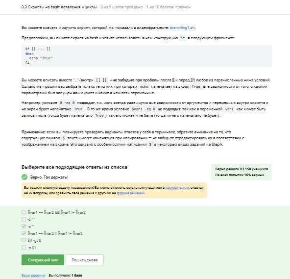

# Задание 3.3.5

# Задание 3.3.6

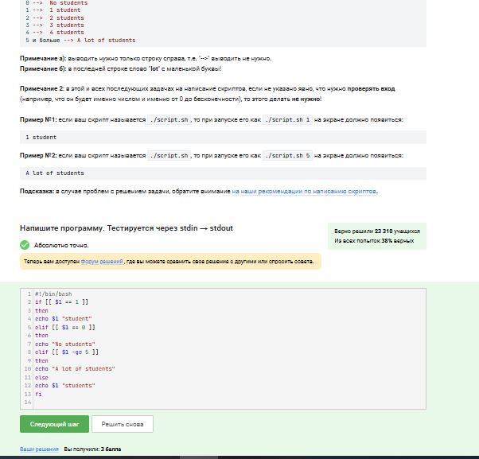

# Задание 3.3.8

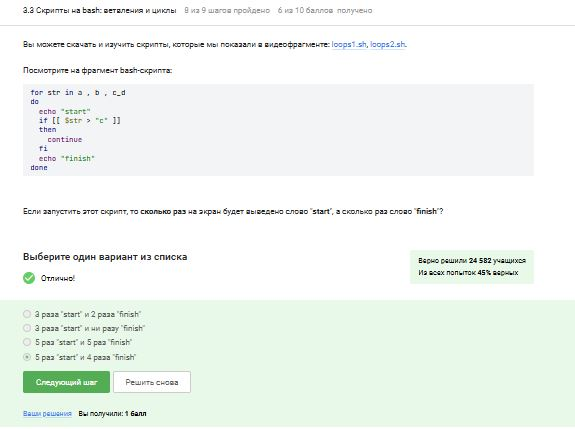

# Задание 3.3.9

**После изучения скриптов на bash: разное, мне нужно было ответить на следующие тестовые вопросы:**

# Задание 3.4.3

# Задание 3.4.5

# Задание 3.4.6

# Задание 3.4.8

# Задание 3.4.9

# Задание 3.4.10

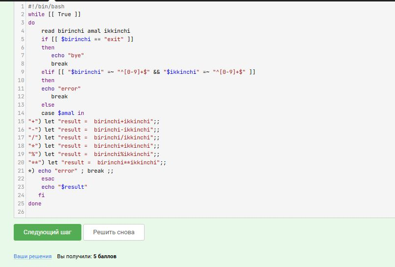

**После изучения продвинутого поиска и редактирования, мне нужно было ответить на следующие тестовые вопросы:**

# Задание 3.5.3

# Задание 3.5.4

# Задание 3.5.5

# Задание 3.5.7

# Задание 3.5.9

# Задание 3.5.11

# Задание 3.5.12

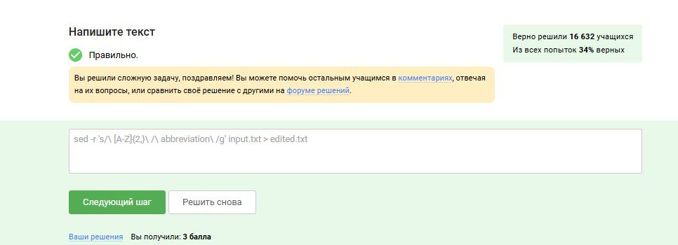

**После изучения построения графиков в gnuplot, мне нужно было ответить на следующие тестовые вопросы:**

# Задание 3.6.3

# Задание 3.6.5

# Задание 3.6.7

# Задание 3.6.10

**После изучения пункта Разное, мне нужно было ответить на следующие тестовые вопросы:**

# Задание 3.7.4

# Задание 3.7.5

# Задание 3.7.7

# Задание 3.7.8

# Задание 3.7.10

## Итог

**Я закончила прохождение внешнего курса и получила сертификат с отличием**

## Вывод

Я познакомилась с операционной системой Linux и её базовыми возможностями. 

## Список литературы

1. http://rus-linux.net/  -- виртуальная энциклопедия Linux 
2. http://www.f-notes.info/linux:linux_command -- довольно обширный список полезных команд терминала.
3. http://ru.najomi.org/_nix -- полезные примеры использования команд терминала
4. http://forum.ubuntu.ru/ -- форум русскоязычного сообщества Ubuntu.
5. http://ru.najomi.org/vim -- команды vim
6. http://lib.ru/LINUXGUIDE/torvalds_jast_for_fun.txt -- книга создателя Linux Линуса Торвальдса "Just for fun".

